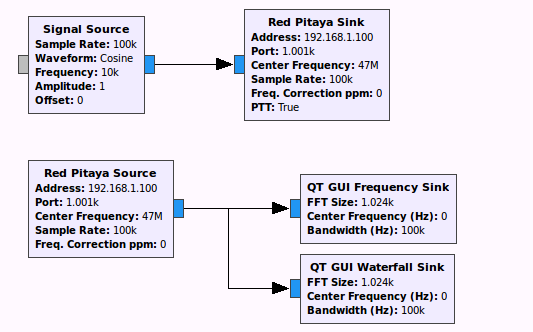

=========
 piradar
=========

`Project Wiki <https://github.com/scivision/piradar/wiki>`_

`Executive summary <https://www.scivision.co/pi-radar/>`_

Radar using Red Pitaya for RF and Raspberry Pi 3 for quad-core signal processing. 
Initially used for ionospheric imaging at HF but via frequency translation could be used at microwave and other frequencies. 
Also can be used at `low-band VHF for short-range compact radar work <https://www.scivision.co/narrowband-lowband-vhf-software-defined-radar-simulation/>`_.

.. contents::

Setup Red Pitaya Radar software
================================
To connect over Ethernet from GNU Radio to the Red Pitaya, setup an image on the Red Pitaya's micro SD card and setup GNU Radio on your Linux laptop.

Install Red Pitaya GNU Radio image
----------------------------------
This assumes a brand new Red Pitaya with blank micro SD card.

1. format a micro SD card to FAT32
2. unzip `Pavel Demins SD Card GNU Radio image <https://pavel-demin.github.io/red-pitaya-notes/sdr-transceiver/>`_ (Under "getting started with GNU Radio") to this SD card::

    unzip ecosystem-0.95-1-6deb253-sdr-transceiver.zip -d /media/sd-card

   where ``/media/sd-card`` is the mounted SD card path to the FAT32-formatted SD card on your laptop. You can find this path with the command ``df``. 
3. boot the Red Pitaya with this micro SD card. login/password ``root``

Install GNU Radio Red Pitaya tools
----------------------------------
On your laptop::

    mkdir ~/code

    cd ~/code

    git clone https://github.com/pavel-demin/red-pitaya-notes

On your laptop, create an executable file ``~/rpgr`` with contents::

    #!/bin/bash
    export GRC_BLOCKS_PATH=$HOME/code/red-pitaya-notes/projects/sdr_transceiver/gnuradio
    gnuradio-companion

Then in the future to startup GNU Radio with the modules for the Red Pitaya, just type on your laptop::

    ~/rpgr

CW Radar using Red Pitaya
=========================
The program ``CW_Doppler.py`` models beat frequency vs. radar frequency and target radial velocity.

The program ``CW_red-pitaya.grc`` is the first steps towards a `CW radar using Red Pitaya <https://www.scivision.co/cw-radar-red-pitaya>`_.

Radar beat frequency finding
============================
Beat frequency estimation demonstration::

    python CWsubspace.py

This requires first installing the ``signal_subpace`` estimator::

    cd ~/code
    git clone https://github.com/scivision/signal_subspace
    cd signal_subspace
    python setup.py develop
    cd ../piradar

    python CWsubspace.py

FMCW Radar using Red Pitaya
===========================
The program ``FMCW_sim.grc`` is a simulation of FMCW radar, as simple as possible. 
It leaves the receive signal glitches inherent to the resetting of the sawtooth and triangle waveforms.
These would be eliminated by dropping those samples in post-processing as an easy solution.

The program ``FMCW_red-pitaya.grc`` operates at low-band VHF in the `license-free bands available globally <https://www.scivision.co/license-free-global-25-60-mhz/>`_.

DSSS Transmit waveform generation
=================================
You can just generate the DSSS waveforms in memory or to disk on your PC.
You don't actually need the Red Pitaya to work with these offline, to test your algorithms in the computer alone.

To run the Red Pitaya radar with DSSS on the bench, you need to

1. generate a binary file containing a psuedorandom phase modulated signal with ``create_waveform``
2. use GNU Radio to read that file and transmit it
3. either on the same or separate Red Pitaya, receive the transmitted waveform and save it to file
4. use a Python (or whatever) script to process the transmit and receive waveforms together e.g. cross-correlation, estimate number of lags to peak.

To transmit these waveforms with the Red Pitaya, tell GNU Radio to read the waveform file you generated and transmit it with the appropriate block diagram.
    
Generate phase modulation in RAM and plot spectrum
--------------------------------------------------
if no options specified, it plots only::

    ./create_waveform.py

-o directory     saves binary psuedorandom phase modulated signal to *directory* for use with GNU Radio
-q               quiet, no plotting
--filter         smoothes transmit waveform, reducing splatter
--fs fsampleHz   sample frequency in Hz of baseband waveform

The following option is for Raspberry Pi only; no longer used

-f frequencyMHz     center frequency in MHz to transmit from Raspberry Pi GPIO

Simulate Psuedorandom PM transceiver
------------------------------------
This is to get started with GRC, to see how it reads/writes files generated in an offline program such as ``create_waveform.py``::

    ~/rpgr PM_sim.grc

variable ``dist_m`` is adjusted to make a simulated point target.

The output is processed with ``receive.py``, which should match the distance specified in ``dist_m`` in ``PM_sim.grc``.

NOTE: there may be a bug with GRC Delay Block in GNU Radio 3.7.9; it seems to truncate the file causing a 120 km bias. 
We can just workaround this for now, because maybe it was fixed in GNU Radio 3.7.10.

Actual psuedorandom PM with Red Pitaya
--------------------------------------
Now we put the psuedorandom PM on the hardware transmitter/receiver with the Red Pitaya DAC and ADC respectively::

    ~/rpgr PM_red-pitaya.grc

Reference
=========
This info is for Red Pitaya, but not necessarily what will be used for PiRadar. 
Just informational.

Simulate BPSK transceiver
-------------------------
Note, this is not the CDMA waveform, just for testing/understanding how to send/receive phase modulated signals::

    ~/rpgr PSK_sim.grc

Actual BPSK transceiver with Red Pitaya
---------------------------------------
This saves the received packets to a file. 
They should match the transmitted packets. 
Again, this is not the actual on-air format we'll use::

    ~/rpgr PSK_red-pitaya.grc

GNU Radio
---------
The ``.grc`` are for GNU Radio Companion (GRC), the graphical IDE.
Currently we are using GRC 3.7.9 on Ubuntu 16.04 for bench development.
Of course, GNU Radio also runs on 

* `Mac <http://gnuradio.org/redmine/projects/gnuradio/wiki/MacInstall>`_
* `Windows <http://gnuradio.org/redmine/projects/gnuradio/wiki/windowsinstall>`_
* `Windows Subsystem for Linux <https://www.scivision.co/gnu-radio-companion-windows-subsystem-for-linux/>`_.

Of course, the actual fielded system will be on the Red Pitaya without the GUI.

* "signal source" is simulating a DDS
* "multiply" is simulating DUC (with the DDS).
* "rational resampler" controls how fast the bits are played back and hence the instantaneous bandwidth of the signal.
* "multiply const" controls the transmitter power. It would need to be like 0.01 or less to avoid overloading the Red Pitaya input if connecting output to input.

**NOTE**: you must have a `softlink to red_pitaya.py in your project directory <https://www.scivision.co/red-pitaya-gnuradio-setup/>`_ where the ``.grc`` files are, or you will get

    ImportError: module red_pitaya not found.

How GRC blocks work
~~~~~~~~~~~~~~~~~~~
These paths are for GNU radio 3.7.9 on Ubuntu 16.04.

1. Graphical block based on .xml in ``/usr/share/gnuradio/grc/blocks``
2. Corresponding Python code in ``/usr/lib/python2.7/dist-packages/gnuradio``
3. Python code calls C++ code under ``/usr/include/gnuradio`` compiled with SWIG

When using GNU Radio without GRC from Python, you are using #2 and #3.

Testing code
============

Transponder (acts as a frequency-translating, amplifying target back to the radar source) 
`xpond_red-pitaya.grc`

Reference (obsolete)
====================
The material in this section is for using Raspberry Pi as the transmitter, which we no longer use.

* Raspberry Pi module has been added to https://github.com/jvierine/digital_rf
* can use https://github.com/jvierine/gr-drf

Raspberry Pi Transmit Install
-----------------------------
We use the Red Pitaya to transmit instead.
The program below uses Rpi GPIO to transmit waveforms, but we found the jitter way too high to use for radar.

On your Raspberry Pi (it will ask for sudo password)::

    ./setup_raspberrypi.sh
    
    python setup.py develop
    
Or on your PC::

    python setup.py develop

Raspi transmit PM  
-----------------
centered @ 100.1MHz::
    
    ./create_waveform.py -f 100.1

